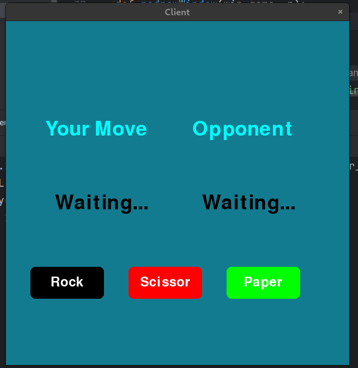
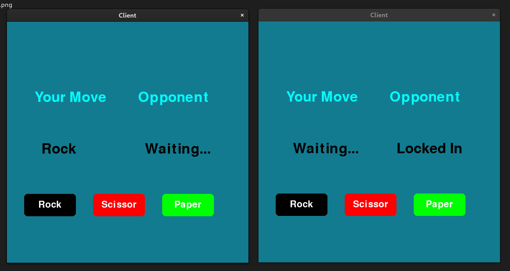

# Rock Paper Scissors Online Game with Python Socket

This repository contains a simple implementation of the classic Rock Paper Scissors game built using Python sockets for online multiplayer functionality.



## Description

This project allows two players to connect to a server and play Rock Paper Scissors against each other in real-time over a network connection. It demonstrates basic socket programming concepts in Python and offers a fun way to engage in a timeless game with friends remotely.

## Playe Againt other


## Installation
To run this game on your local machine, you can clone this repository using the following command:

```bash
git clone https://github.com/DuyHuynh153/online-simple-game.git
